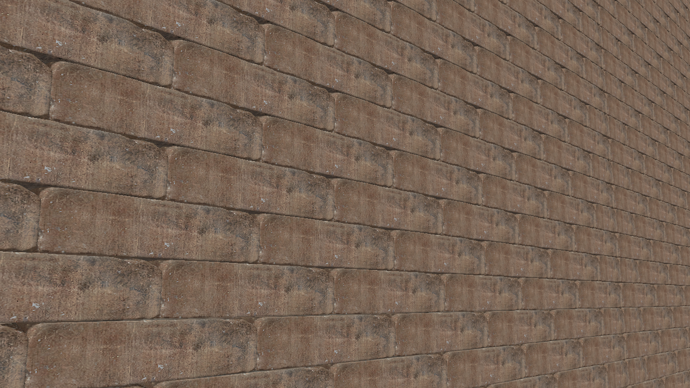

# SW Corner Report — Village Builder Status

## Screenshot

Close-up of the SW corner (Wall_W_0 ↔ Wall_S_0) from this session:



The file is also kept at `scrap/sw_corner_close.png` for reference.

## Current state

The southwest corner where the West wall meets the South wall has been inspected both structurally and visually.

### Runtime topology probe (`lute_get_corner_topology`)

```
Wall_W_0 <-> Wall_S_0:
  valid            = True
  courses          = 65
  incomplete       = 0
  doubleOwned      = 0
  unowned          = 0
  duplicatePairs   = 0
  alternates       = True
  endpointDistance = 4.92 units (~0.125m, the West wall inset)
```

The corner passes every deterministic check:
- 65 courses present, none incomplete.
- No course is double-owned or unowned.
- No duplicate brick pairs overlap.
- Ownership alternates correctly across courses.

### GPT vision close-up

- No open gap is visible — at most a hairline seam (<1-2mm).
- The walls meet as a tight **butt joint**.
- Bricks do **not** visibly interlock (no quoined masonry).
- Structurally a butt joint is weaker than an interlocking corner.

## What we did to get here

1. Fixed an editor crash caused by unbounded recursion in `ValidatePlacement` / `FindNearestValidPosition`.
2. Removed scene raycasting from placement validation; occupancy + reservations are now authoritative.
3. Added an editor-side MCP wrapper (`sbox/editor/Code/LuteSpatialMcp.cs`) exposing `lute_spatial` tools without reflection or manual DLL loading.
4. Added `lute_get_corner_topology` for deterministic corner validation.
5. Moved the West wall inward by half a brick (`0.125m`) to close the visible gap at the SW corner.
6. Widened `EndpointTolerance` to `0.2m` so the probe detects the West wall corner pair after the inset.

Commits (on `main`):
- `9820c88` Fix editor crash: remove recursion, scene raycasting; add editor MCP project
- `1d89209` Add lute_get_corner_topology MCP tool
- `116dc75` Move West wall inward by half a brick to close SW corner gap
- `19a0b97` Widen EndpointTolerance to detect West wall corner pairs after inset

## Goal

The long-term goal is an **autonomous** village builder. The builders should keep building with their own problem solving — the development agent should only provide a blueprint and let the NPCs fine-tune placement, not micromanage every brick.

So far we have been micromanaging the wall layout to establish a working blueprint for walls. That blueprint now exists:
- Deterministic wall segment placement.
- Occupancy/reservation validation.
- Corner topology validation.
- Save/resume behavior.

## Options from here

### Option A — Accept the SW corner as-is
- The corner is structurally valid and visually tight (hairline seam only).
- No further layout change is needed.
- We move on to the other three corners and the rest of the village.
- Risk: corners remain butt joints, not interlocking masonry.

### Option B — Implement visible quoins (interlocking corner bricks)
- Modify corner brick placement so bricks physically cross the seam on alternating courses.
- Preserves deterministic single ownership and the topology validator's guarantees.
- Changes the corner-brick layout (against the current constraint of keeping the layout).
- Produces a visually traditional masonry corner.

### Option C — Let the builders fine-tune their own placement
- Instead of the development agent micromanaging corner geometry, give the builders a goal-level rule (e.g. "close all gaps at corners") and let them detect and repair gaps themselves at runtime.
- This aligns with the project goal of autonomous building with the NPCs' own problem solving.
- Requires adding a runtime self-inspection/repair pass to the builder logic.
- Keeps the development agent out of per-brick placement decisions.

## Recommendation

The project goal is autonomous building. Option C is the most aligned with that goal: stop micromanaging corner geometry and instead give the builders the ability to detect and fix gaps themselves. Option A is acceptable as a short-term checkpoint; Option B is a layout change we wanted to avoid.

## Relevant files

- `sbox/code/Building/WallCornerTopologyProbe.cs` — corner topology validator
- `sbox/code/Building/VillageGrammar.cs` — wall segment positioning (West wall inset lives here)
- `sbox/code/Building/VillageBuilder.cs` — brick placement and corner ownership
- `sbox/code/Building/ConstructionDirector.cs` — task assignment and scheduling
- `sbox/code/Building/LuteSpatialTools.cs` — spatial API surface
- `sbox/editor/Code/LuteSpatialMcp.cs` — editor MCP wrapper
- `sw_corner_close.png` — close-up screenshot referenced above
